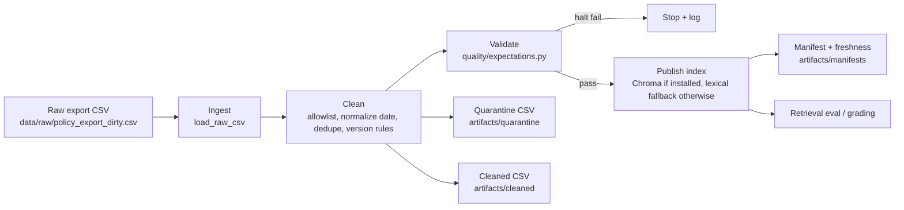

# Kiến trúc pipeline — Lab Day 10

**Nhóm:** Day 10 Lab  
**Cập nhật:** 2026-06-10

## 1. Sơ đồ luồng

Freshness được đo sau publish từ `latest_exported_at` trong manifest. `run_id` được ghi vào log, manifest và metadata/index để đối chiếu artifact.

## 2. Ranh giới trách nhiệm

| Thành phần | Input | Output | Owner nhóm |
|------------|-------|--------|------------|
| Ingest | `data/raw/policy_export_dirty.csv` | raw rows + `raw_records` | Raw Owner |
| Transform | raw rows | cleaned rows + quarantine rows | Cleaning Owner |
| Quality | cleaned rows | expectation log, halt/warn decision | Quality Owner |
| Embed/Index | cleaned CSV | Chroma collection hoặc `artifacts/index/day10_index.json` | Embed Owner |
| Monitor | manifest | freshness PASS/WARN/FAIL | Monitoring Owner |

## 3. Idempotency & rerun

Chroma path dùng `upsert` theo `chunk_id` và prune id không còn trong cleaned run để index là snapshot của lần publish mới nhất. Khi thiếu Chroma/SentenceTransformers, fallback ghi đè `artifacts/index/day10_index.json`, cũng là snapshot theo run cuối nên rerun không sinh duplicate.

## 4. Liên hệ Day 09

Pipeline này chuẩn hóa tầng dữ liệu cho cùng case CS + IT Helpdesk của Day 08/09. Agent/RAG chỉ nên đọc collection hoặc fallback index sau khi expectation pass để tránh lấy policy cũ như refund 14 ngày hoặc HR 10 ngày phép.

## 5. Rủi ro đã biết

- Fallback lexical chỉ phục vụ môi trường nhẹ; production nên dùng Chroma + embedding thật.
- Freshness đang dùng SLA 2160h cho snapshot lab, không phải SLA production.
- Nếu raw export thêm doc mới, phải đồng bộ `ALLOWED_DOC_IDS`, contract và expectation coverage.
